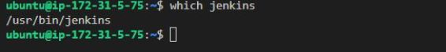
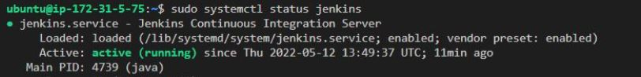
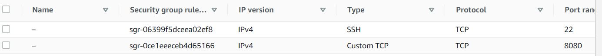
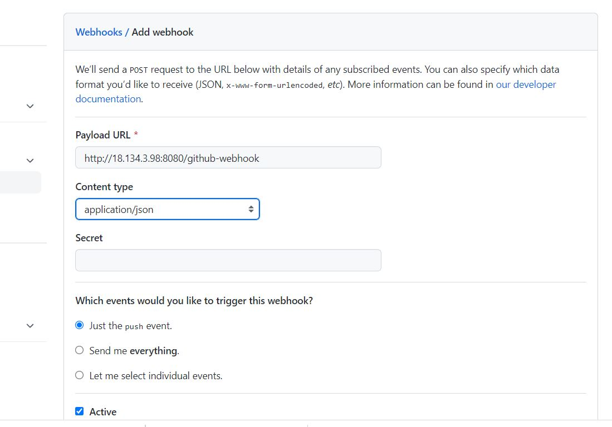
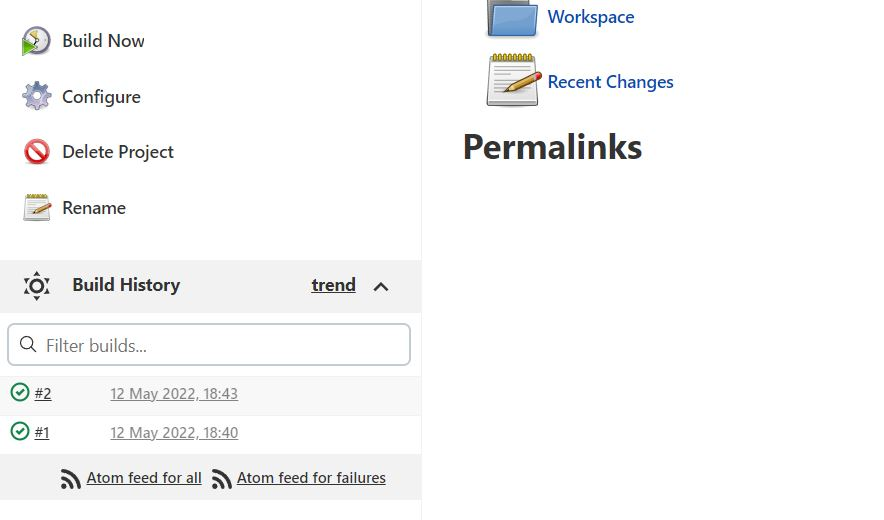
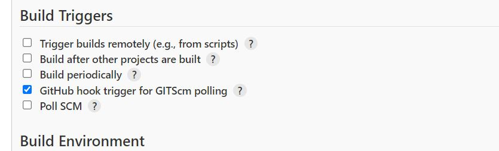
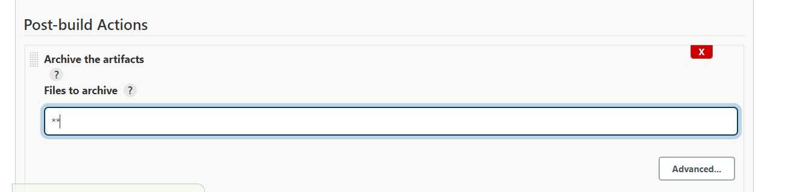

## Project 11 Documentation
---
### We launched the following instances:

#### 3 RHEL Instances

* Webserver-1
*  Webserver-2
* NFS

#### 3 Ubuntu Instances

* LB
* DB
* Jenkins-Ansible


---
## Then I installed and configured Jenkins on the Jenkins-Ansible server
---

#### Update the jenkins server 
```
sudo apt update
```
#### Install the Java Development Kit and dependencies 
```
sudo apt install default-jdk-headless
```

#### Install Jenkins
```
wget -q -O - https://pkg.jenkins.io/debian-stable/jenkins.io.key | sudo apt-key add -
sudo sh -c 'echo deb https://pkg.jenkins.io/debian-stable binary/ > \
    /etc/apt/sources.list.d/jenkins.list'

sudo apt update
sudo apt-get install jenkins
```
#### Jenkins successfully installed


```
sudo systemctl status jenkins
```


#### Next I opened port 8080 inthe Jenkins-Ansible security group as it is the port that Jenkins uses.  




Next I loaded the jenkins page in the web browser
http://18.134.3.98:8080        


  

Next, I got the password from /var/lib/jenkins/secrets/initialAdminPassword and set up Jenkins on the web browser        


    


```
sudo cat /var/lib/jenkins/secrets/initialAdminPassword
```

The next step was to customize Jenkins. I selected the Install suggested plugins option  

  

---
## The next step was to configure Jenkins to retrieve source codes from GitHub using Webhooks
---  

### I created a github repository called project-ansible  

### I enabled webhook in the github repository settings



### created a freestyle project called ansible in Jenkins

### In configuration of the Jenkins freestyle project (Ansible) , I choose Git repository

### I then entered the url of my git repository

### I changed the branch to build from master to main

### I saved and ran the build which was successful  




### The next step was to configure Jenkins so that the build is automated - triggered from a github webhook  


### I selected the GitHub hook trigger for GITScm polling option checkbox  





### I then set the post build actions to archive the artifacts



### The next step was to push changes from VS Code to Github and see if the build was triggered by the webhook

