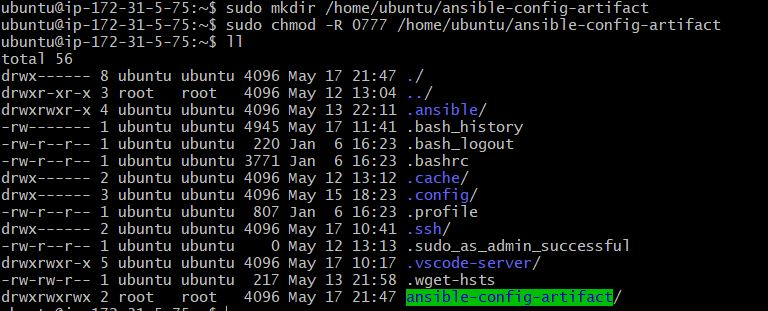
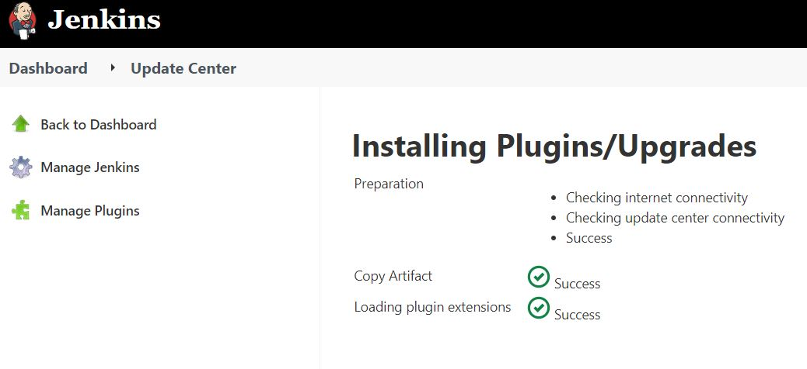

Project 12
----------------------------

### Jenkins job enhancement

### I SSH'd into the Jenkins-Ansible-Server to create a directory named ansible-config-artifact

```
sudo mkdir /home/ubuntu/ansible-config-artifact

sudo chmod -R 0777 /home/ubuntu/ansible-config-artifact

```
I ran ll to check permissions and owner

```
ll
```


  

### Next step was to download the copy artifactc plugin in Jenkins

 

### I created a new Freestyle project and named it save_artifacts.

### This project will be triggered by completion of the existing ansible project. 


### I created a new item and configured it as such

- I checked the Discard old builds checkbox
- Set the Max # of builds to 2
- Left source code management as None
- Under Build Triggers, I selected Build after other projects are built
- For Projects to watch, I selected the previous project called ansible
- I created a build step and selected copy artifacts from another project
- For project name, I selected ansible
- Artifacts to copy was set as ** 
- For artifacts not to copy, I entered README.md
- Target directory was set as /home/ubuntu/ansible-config-artifact

### I pushed the changes made to git to check if the setup was working correctly

### I did a chmod -R 777 against /home


